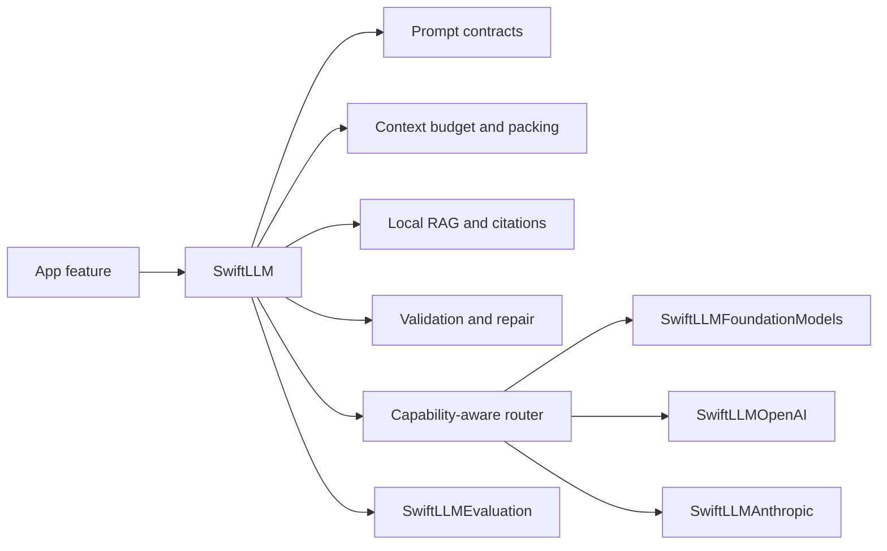
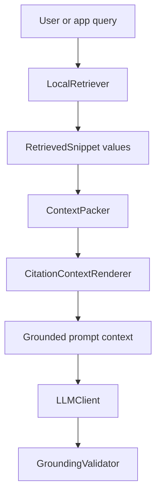
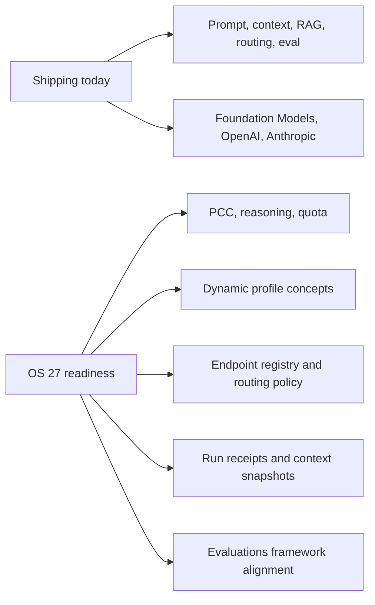

# SwiftLLM

[](https://swift.org)
[](#requirements)
[](LICENSE.md)
[](https://github.com/mrbagels/swift-llm/actions/workflows/ci.yml)

SwiftLLM is a Swift-native reliability layer for local-first language model features on Apple platforms.

It helps you build AI features where the hard parts are explicit: prompt contracts, token budgets, context packing, local retrieval, structured generation, validation, fallback, provider routing, and evaluation. The core package has no network access and no telemetry. External providers live in opt-in adapter targets.

## Why It Exists

Apple's Foundation Models framework makes on-device language model features possible with native Swift APIs. Production apps still need the surrounding reliability layer:

- prompts need versioning
- context needs a budget
- long inputs need chunking
- local sources need citations
- structured outputs need validation
- fallbacks need policy
- model behavior needs evaluation
- diagnostics need redaction

SwiftLLM keeps those concerns app-neutral so each app does not rebuild the same machinery.

## What Ships

| Product | Use it for |
|---|---|
| `SwiftLLM` | Core prompt, context, RAG, validation, workflow, router, metadata, and client primitives |
| `SwiftLLMFoundationModels` | Apple Foundation Models availability, token counting, prewarming, typed generation, native tools, and error normalization |
| `SwiftLLMOpenAI` | OpenAI Responses API adapter with injectable response and streaming transport |
| `SwiftLLMAnthropic` | Anthropic Messages API adapter with injectable response and streaming transport |
| `SwiftLLMEvaluation` | Prompt regression, structured output assertions, fallback matrices, and local debug bundles |



## Requirements

- Swift 6.2 or newer
- iOS 26, macOS 26, or visionOS 26 minimum package targets
- Xcode with the matching Apple platform SDKs
- XcodeGen only for the optional showcase app

The package is prepared to model OS 27 Foundation Models concepts, including Private Cloud Compute, dynamic context size, reasoning, Dynamic Profiles, provider packages, and Evaluations. watchOS support will require adding a package platform target. Code that imports unavailable OS 27 symbols will be added only after the local SDK is installed and guarded with availability checks.

## Installation

Add the package with Swift Package Manager:

```swift
dependencies: [
  .package(url: "https://github.com/mrbagels/swift-llm.git", from: "0.1.0")
]
```

Then add only the products you need:

```swift
.target(
  name: "YourApp",
  dependencies: [
    .product(name: "SwiftLLM", package: "swift-llm"),
    .product(name: "SwiftLLMFoundationModels", package: "swift-llm")
  ]
)
```

During active pre-release development, pin to the `next` branch if a `0.1.0` tag is not available yet.

## Quick Start

Use the on-device Foundation Models adapter directly:

```swift
import SwiftLLM
import SwiftLLMFoundationModels

let client = FoundationModelClient.live

guard client.availability().isAvailable else {
  throw LLMClientError(reason: .unavailable)
}

let response = try await client.respond(
  to: LLMRequest(
    instructions: "Summarize the note in one sentence.",
    messages: [.user(noteText)],
    parameters: .init(maxOutputTokens: 120)
  )
)

print(response.text)
```

Route across local and explicitly configured provider-backed clients:

```swift
import SwiftLLM
import SwiftLLMAnthropic
import SwiftLLMFoundationModels
import SwiftLLMOpenAI

let local = AnyLLMClient(FoundationModelClient.live)
let openAI = AnyLLMClient.openAI(apiKey: openAIKey, model: "your-openai-model")
let anthropic = AnyLLMClient.anthropic(apiKey: anthropicKey, model: "your-anthropic-model")

let client = LLMRouter(
  primary: local,
  fallbacks: [openAI, anthropic]
)

let response = try await client.respond(
  to: LLMRequest(
    instructions: "Extract the decision, owner, and due date.",
    messages: [.user(meetingNote)],
    responseFormat: .jsonObject,
    parameters: .deterministic
  )
)
```

API keys are provided by your app at runtime. SwiftLLM does not define a key storage policy and does not persist credentials.

## Prompt Contracts

Prompt contracts make prompt changes reviewable:

```swift
let contract = PromptContract(
  id: "note-summary",
  version: "2026-06-24",
  instructions: "Summarize only facts present in the input.",
  responseSchemaDescription: "Return one concise paragraph."
)

let prompt = CompiledPrompt(
  contract: contract,
  metadata: client.metadata,
  userPrompt: noteText
)

let response = try await client.respond(to: LLMRequest(prompt: prompt))
```

## Context Budgeting

Pack retrieved snippets into an explicit token budget:

```swift
let snippets: [RetrievedSnippet] = [
  RetrievedSnippet(
    id: "policy-1",
    sourceID: "handbook",
    text: "Approvals are required before external provider calls.",
    tokenCount: 12,
    score: 0.98,
    sourceDisplayName: "Engineering Handbook",
    isRequired: true
  )
]

let packer = ContextPacker(
  budget: TokenBudget(
    contextLimit: 4_096,
    reservedResponseTokens: 512,
    safetyMarginTokens: 256
  ),
  strategy: .sourceDiverse
)

let packed = packer.pack(snippets: snippets, reservedInputTokens: 300)
```

## Local RAG

SwiftLLM includes dependency-free retrieval primitives. Apps can bring their own index, SQLite store, Spotlight search, embeddings, or document pipeline by conforming to `LocalRetriever`.



The built-in `KeywordLocalRetriever` is intentionally simple and deterministic. It is useful for tests, examples, small local corpora, and as a reference implementation.

## Workflows

`LLMWorkflow` composes app-owned steps without creating a hidden autonomous agent:

```swift
let workflow = LLMWorkflow(detectHints)
  .then(retrieveLocalContext)
  .then(buildPromptPlan)
  .then(generateCandidate)
  .then(validateGrounding)
  .then(repairOrFallback)
```

Workflow results can carry events, intermediate outputs, context budget reports, provider metadata, validation issues, fallback reasons, and source evidence.

## Evaluation

Use `SwiftLLMEvaluation` to keep prompt behavior visible as models and prompts change:

```swift
import SwiftLLMEvaluation

let evaluationCase = PromptEvaluationCase(
  id: "summary-keeps-owner",
  input: "Maya owns the database migration by Friday.",
  requiredSubstrings: ["Maya", "Friday"],
  forbiddenSubstrings: ["Monday"]
)

let result = PromptEvaluator().evaluate(
  evaluationCase,
  output: response.text
)

precondition(result.passed, result.failures.joined(separator: "\n"))
```

## Provider Boundaries

SwiftLLM is designed around explicit boundaries:

| Boundary | Package posture |
|---|---|
| Core package | No network access, no telemetry, no provider keys |
| Foundation Models | Isolated to `SwiftLLMFoundationModels` |
| OpenAI and Anthropic | Opt-in adapter products |
| API keys | App-owned, runtime-provided, never persisted by SwiftLLM |
| Native Apple tools | Typed Foundation Models API only |
| Provider-neutral tools | Request/response shapes only, no hidden local execution |
| Diagnostics | Local and redacted by default |

Native Foundation Models `Tool` values stay on the typed `SwiftLLMFoundationModels` API. Provider-neutral requests intentionally reject local tool execution unless an app calls the Foundation-specific wrapper with concrete `[any Tool]` values.

## WWDC26 Readiness

Apple's WWDC26 Foundation Models updates point directly at SwiftLLM's roadmap:

- Private Cloud Compute through `PrivateCloudComputeLanguageModel`
- dynamic `contextSize`
- reasoning levels and reasoning token accounting
- quota usage and graceful fallback UI hooks
- Dynamic Profiles for model, tool, instruction, and transcript changes
- `LanguageModel` and `LanguageModelExecutor` provider packages
- Core AI and MLX-backed local language models
- system tools for Vision and Spotlight-backed RAG
- Evaluations framework integration in Xcode 27
- `fm` CLI and Python SDK workflows for prompt iteration

SwiftLLM's current code remains SDK-safe for the installed iOS 26 era toolchain. The planned OS 27 work is tracked in [Roadmap](docs/09-roadmap.md) and [WWDC26 Readiness](docs/14-wwdc26-readiness.md).



## Showcase

The repository includes an XcodeGen iOS showcase shell:

```sh
xcodegen generate --spec Examples/LLMShowcase/project.yml
open Examples/LLMShowcase/LLMShowcase.xcodeproj
```

Generated `.xcodeproj` files are intentionally ignored.

## Verification

```sh
swift build
swift test
swift build -Xswiftc -warnings-as-errors
./scripts/validate.sh
```

`./scripts/validate.sh` also validates the agent manifest, regenerates the showcase project when XcodeGen is installed, and builds the showcase when `xcodebuild` is available.

## Documentation

Start with:

- [Docs Index](docs/README.md)
- [Overview](docs/00-overview.md)
- [Architecture](docs/01-architecture.md)
- [Foundation Models Reference](docs/02-foundation-models-reference.md)
- [Reliability Patterns](docs/03-reliability-patterns.md)
- [Context and Chunking](docs/04-context-and-chunking.md)
- [Structured Generation](docs/05-structured-generation.md)
- [Local RAG](docs/06-local-rag.md)
- [Evaluation and Diagnostics](docs/07-evaluation-and-diagnostics.md)
- [Roadmap](docs/09-roadmap.md)
- [Open Source Readiness](docs/10-open-source-readiness.md)
- [API Stability](docs/11-api-stability.md)
- [Release Process](docs/12-release-process.md)
- [Provider Adapters](docs/13-provider-adapters.md)
- [WWDC26 Readiness](docs/14-wwdc26-readiness.md)

Agents should start at [llm/START_HERE.md](llm/START_HERE.md).

## Contributing

Contributions should keep SwiftLLM app-neutral, local-first by default, and explicit about provider boundaries. See [CONTRIBUTING.md](CONTRIBUTING.md).

## License

SwiftLLM is released under the [Apache License 2.0](LICENSE.md).
